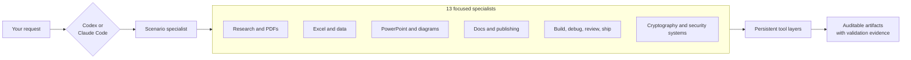
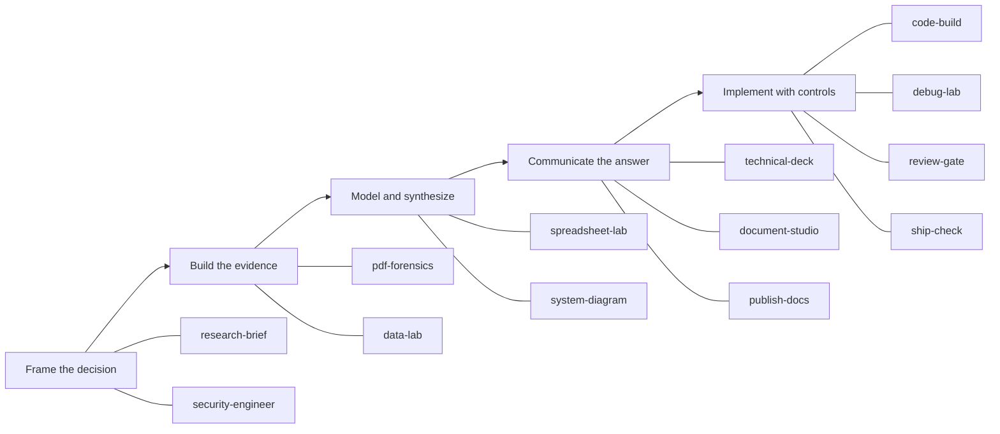
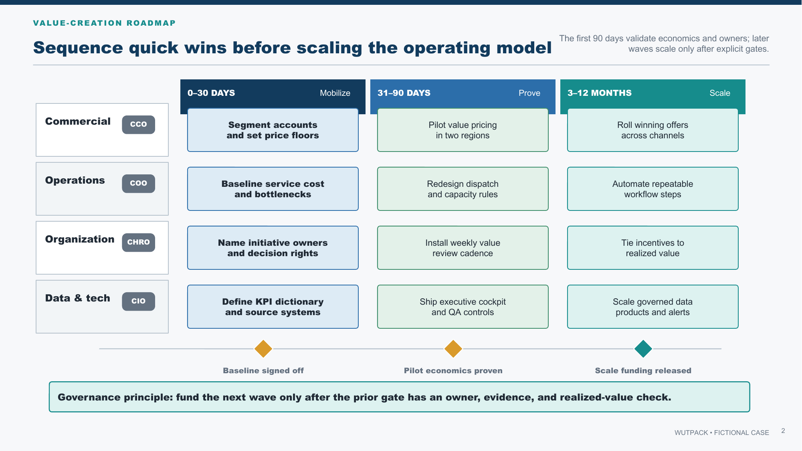
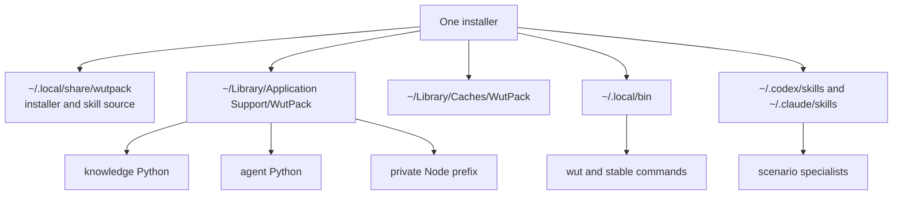

# WutPack

[](https://github.com/sfungwinbond/Gstackwut/actions/workflows/validate.yml)
[](https://github.com/sfungwinbond/Gstackwut/actions/workflows/fresh-install.yml)
[](https://sfungwinbond.github.io/Gstackwut/)
[](https://github.com/sfungwinbond/Gstackwut/releases/latest)

**The Wut CLI: a persistent AI workbench with 53 verified tools, thirteen
specialists, and 30 career toolpacks.**

One install. Real local tools. A Mac workbench that is still there tomorrow.

[See the small-business landing page →](https://sfungwinbond.github.io/Gstackwut/)

WutPack turns a fresh Mac into a practical Codex and Claude Code knowledge-work
station. It installs both CLIs by default, then provides the
environment-and-workflow layer around them: durable document, data, browser,
diagram, publishing, and agent tools; focused skills
that know when and how to use them; and validation gates for the artifacts they
produce. The `wut` CLI also exposes 30 role-shaped packs across a transparent
high-pay snapshot, finance, and engineering.

The point is not another folder of prompts. The point is a working toolchain:
research a market, recover a broken PDF, build a Windows-safe decision model,
draw an editable executive roadmap, analyze customer data, model a secure boot
chain, publish code as HTML,
or take a code change through review—with the same commands available in the
next terminal and the next agent session.

## Install

On macOS, run:

```bash
curl -fsSL https://raw.githubusercontent.com/sfungwinbond/Gstackwut/main/install.sh | bash
```

Open a new terminal, then verify the workbench:

```bash
wut doctor
wut routes
```

The default `full` profile is the maximal setup. It installs desktop apps and
command-line tools, a managed Python 3.12 knowledge environment, a separate
agent-framework environment, private Node tooling, and skills for every detected
host. It does **not** collect credentials or configure API keys.

Prefer to inspect code before running it? Clone the repository, read
[`install.sh`](install.sh) and [`setup`](setup), then run `./setup`.

## The knowledge-work harness



Codex or Claude Code still owns the model-facing agent loop, permissions, auth,
and orchestration. WutPack supplies the portable layer around that loop: the host
routes a job to a specialist; the specialist supplies a workflow, quality gates,
and deterministic helpers; persistent applications and libraries do the real
file or code work. This is a harness for repeatable knowledge work, not a new
model runtime.

## Pick a specialist

| Scenario | Skill | Typical deliverable |
|---|---|---|
| Current, attributable research | `research-brief` | Decision brief with primary-source citations |
| Excel models, formulas, and charts | `spreadsheet-lab` | Editable `.xlsx`, validated and render-checked |
| Scanned, damaged, or difficult PDFs | `pdf-forensics` | Repaired/searchable PDF plus extraction report |
| Executive and technical diagrams in PowerPoint | `technical-deck` | Native editable shapes, connectors, and charts |
| CSV, Parquet, SQL, statistics, or ML | `data-lab` | Reproducible notebook, figures, and findings |
| HTML/PDF sites, books, and API docs | `publish-docs` | Quarto, MkDocs, Sphinx, pdoc, or TypeDoc output |
| Architecture, sequence, and state diagrams | `system-diagram` | Mermaid/Graphviz/PlantUML source plus render |
| Applied cryptography and embedded trust | `security-engineer` | Threat model, protocol/boot diagrams, simulations, and interview drills |
| Professional Word or OpenDocument files | `document-studio` | Structured `.docx`/`.odt` with compatibility check |
| Implementing repository changes | `code-build` | Scoped change with tests and handoff |
| Root-cause debugging | `debug-lab` | Reproduction, evidence, fix, and regression test |
| Pre-merge review | `review-gate` | Severity-ordered actionable findings |
| Release readiness | `ship-check` | READY/NOT READY verdict with evidence |

Use natural language and let the host select a skill, or invoke one explicitly:

```text
# Codex
$spreadsheet-lab Build a market-entry model from the evidence in this folder.

# Claude Code
/spreadsheet-lab Build a market-entry model from the evidence in this folder.
```

## What gets installed

| Layer | Selected tools |
|---|---|
| Desktop workbench | LibreOffice, Chromium, Quarto, draw.io, Inkscape |
| AI coding CLIs | Codex, Claude Code |
| Office, PDF, and media | openpyxl, XlsxWriter, python-docx, python-pptx, CairoSVG, Pandoc, Poppler, qpdf, MuPDF, OCRmyPDF, Tesseract, ImageMagick, FFmpeg |
| Data and research | pandas, Polars, Arrow, DuckDB, SciPy, scikit-learn, statsmodels, JupyterLab, Playwright, Selenium, Scrapy |
| Diagrams and documentation | PptxGenJS, Mermaid, Graphviz, PlantUML, Typst, MkDocs, Sphinx, pdoc, Doxygen, JSDoc, TypeDoc |
| Engineering utilities | GitHub CLI, ripgrep, fd, fzf, jq, yq, ShellCheck, shfmt, delta, hyperfine, just |

The manifests are the source of truth, and the maximal profile includes more
libraries than this summary. Fast-moving agent frameworks live in their own
Python environment so their upgrades do not destabilize Office and data work.

## Visual proof gallery

The website includes one visual proof page for every selected tool. These are
generated from real local runs against fictional fixtures: 52 tools are
exercised, while unauthenticated Claude Code is documented as installed-only.

| Layer | Live proof pages |
|---|---|
| Desktop workbench | [LibreOffice](https://sfungwinbond.github.io/Gstackwut/tool-examples/libreoffice.html) · [Chromium](https://sfungwinbond.github.io/Gstackwut/tool-examples/chromium.html) · [Quarto](https://sfungwinbond.github.io/Gstackwut/tool-examples/quarto.html) · [draw.io](https://sfungwinbond.github.io/Gstackwut/tool-examples/drawio.html) · [Inkscape](https://sfungwinbond.github.io/Gstackwut/tool-examples/inkscape.html) |
| AI coding CLIs | [Codex](https://sfungwinbond.github.io/Gstackwut/tool-examples/codex.html) · [Claude Code — installed only](https://sfungwinbond.github.io/Gstackwut/tool-examples/claude-code.html) |
| Office, PDF, and media | [openpyxl](https://sfungwinbond.github.io/Gstackwut/tool-examples/openpyxl.html) · [XlsxWriter](https://sfungwinbond.github.io/Gstackwut/tool-examples/xlsxwriter.html) · [python-docx](https://sfungwinbond.github.io/Gstackwut/tool-examples/python-docx.html) · [python-pptx](https://sfungwinbond.github.io/Gstackwut/tool-examples/python-pptx.html) · [CairoSVG](https://sfungwinbond.github.io/Gstackwut/tool-examples/cairosvg.html) · [Pandoc](https://sfungwinbond.github.io/Gstackwut/tool-examples/pandoc.html) · [Poppler](https://sfungwinbond.github.io/Gstackwut/tool-examples/poppler.html) · [qpdf](https://sfungwinbond.github.io/Gstackwut/tool-examples/qpdf.html) · [MuPDF](https://sfungwinbond.github.io/Gstackwut/tool-examples/mupdf.html) · [OCRmyPDF](https://sfungwinbond.github.io/Gstackwut/tool-examples/ocrmypdf.html) · [Tesseract](https://sfungwinbond.github.io/Gstackwut/tool-examples/tesseract.html) · [ImageMagick](https://sfungwinbond.github.io/Gstackwut/tool-examples/imagemagick.html) · [FFmpeg](https://sfungwinbond.github.io/Gstackwut/tool-examples/ffmpeg.html) |
| Data and research | [pandas](https://sfungwinbond.github.io/Gstackwut/tool-examples/pandas.html) · [Polars](https://sfungwinbond.github.io/Gstackwut/tool-examples/polars.html) · [Arrow](https://sfungwinbond.github.io/Gstackwut/tool-examples/apache-arrow.html) · [DuckDB](https://sfungwinbond.github.io/Gstackwut/tool-examples/duckdb.html) · [SciPy](https://sfungwinbond.github.io/Gstackwut/tool-examples/scipy.html) · [scikit-learn](https://sfungwinbond.github.io/Gstackwut/tool-examples/scikit-learn.html) · [statsmodels](https://sfungwinbond.github.io/Gstackwut/tool-examples/statsmodels.html) · [JupyterLab](https://sfungwinbond.github.io/Gstackwut/tool-examples/jupyterlab.html) · [Playwright](https://sfungwinbond.github.io/Gstackwut/tool-examples/playwright.html) · [Selenium](https://sfungwinbond.github.io/Gstackwut/tool-examples/selenium.html) · [Scrapy](https://sfungwinbond.github.io/Gstackwut/tool-examples/scrapy.html) |
| Diagrams and documentation | [PptxGenJS](https://sfungwinbond.github.io/Gstackwut/tool-examples/pptxgenjs.html) · [Mermaid](https://sfungwinbond.github.io/Gstackwut/tool-examples/mermaid.html) · [Graphviz](https://sfungwinbond.github.io/Gstackwut/tool-examples/graphviz.html) · [PlantUML](https://sfungwinbond.github.io/Gstackwut/tool-examples/plantuml.html) · [Typst](https://sfungwinbond.github.io/Gstackwut/tool-examples/typst.html) · [MkDocs](https://sfungwinbond.github.io/Gstackwut/tool-examples/mkdocs.html) · [Sphinx](https://sfungwinbond.github.io/Gstackwut/tool-examples/sphinx.html) · [pdoc](https://sfungwinbond.github.io/Gstackwut/tool-examples/pdoc.html) · [Doxygen](https://sfungwinbond.github.io/Gstackwut/tool-examples/doxygen.html) · [JSDoc](https://sfungwinbond.github.io/Gstackwut/tool-examples/jsdoc.html) · [TypeDoc](https://sfungwinbond.github.io/Gstackwut/tool-examples/typedoc.html) |
| Engineering utilities | [GitHub CLI](https://sfungwinbond.github.io/Gstackwut/tool-examples/github-cli.html) · [ripgrep](https://sfungwinbond.github.io/Gstackwut/tool-examples/ripgrep.html) · [fd](https://sfungwinbond.github.io/Gstackwut/tool-examples/fd.html) · [fzf](https://sfungwinbond.github.io/Gstackwut/tool-examples/fzf.html) · [jq](https://sfungwinbond.github.io/Gstackwut/tool-examples/jq.html) · [yq](https://sfungwinbond.github.io/Gstackwut/tool-examples/yq.html) · [ShellCheck](https://sfungwinbond.github.io/Gstackwut/tool-examples/shellcheck.html) · [shfmt](https://sfungwinbond.github.io/Gstackwut/tool-examples/shfmt.html) · [delta](https://sfungwinbond.github.io/Gstackwut/tool-examples/delta.html) · [hyperfine](https://sfungwinbond.github.io/Gstackwut/tool-examples/hyperfine.html) · [just](https://sfungwinbond.github.io/Gstackwut/tool-examples/just.html) |

[Open the searchable gallery on the website →](https://sfungwinbond.github.io/Gstackwut/#tool-gallery)

[Browse all 30 career toolpacks on the live website →](https://sfungwinbond.github.io/Gstackwut/toolpacks.html)

[Read the 0.2 release announcement](docs/release-v0.2.0.md) ·
[Use the launch and press kit](docs/launch-kit.md)

## Thirteen-specialist consulting walkthrough

This fictional case follows Atlas Services, a mid-sized field-services company
choosing where to grow and how to fund the move. It is a classic
strategy-consulting workflow: frame the decision, build an evidence base, model
the economics, communicate an answer, then make implementation auditable. Every
name, market, and value below is illustrative; no client or proprietary data is
used.



### 1. Frame the decision

#### `research-brief` — market-entry recommendation

```text
$research-brief For fictional Atlas Services, compare Coastal, North, Central,
and West as expansion markets. Use current primary sources for any real-world
benchmarks, separate facts from assumptions, reconcile conflicts, and deliver a
two-page recommendation with citations, risks, and evidence that would change it.
```

**Produces:** an answer-first decision brief, source ledger, confidence notes,
and explicit open questions.

#### `security-engineer` — cryptography and embedded trust design

```text
$security-engineer Explain and threat-model a fictional component-authentication
design. Draw its X.509 chain, ECDH plus HKDF transcript, MCU verified-boot and
TEE boundaries, StrongBox key-storage assumptions, and DS28C40 challenge/response.
Include negative tests and interview questions; use no production credentials.
```

**Produces:** an evidence-backed architecture explanation, original diagrams,
toy simulations, lifecycle/misuse tests, and a standalone interactive course.
Open the [Security Engineering Lab](https://sfungwinbond.github.io/Gstackwut/security-engineer.html)
or generate it locally with `wut security-lab security-engineering-lab.html`.

### 2. Build the evidence

#### `pdf-forensics` — evidence extraction from reports

```text
$pdf-forensics Inspect inputs/market-reports/*.pdf. Classify text versus scanned
pages, make searchable derivatives where needed, extract market size and margin
tables with page-level provenance, and flag every cell requiring visual review.
```

**Produces:** searchable derivative PDFs, a structural report, cited extraction
tables, and a human-verification queue.

#### `data-lab` — customer and commercial analysis

```text
$data-lab Analyze anonymized_leads.parquet and customers.csv. Preserve raw files,
define the observation grain, profile missingness, compare retention and CAC
payback by segment, quantify uncertainty, and deliver a rerunnable notebook plus
an executive chart.
```

**Produces:** a reproducible notebook, exact result tables, figures, data-quality
notes, and an environment record.

### 3. Model and synthesize

#### `spreadsheet-lab` — scenario economics

```text
$spreadsheet-lab Build Atlas_market_entry.xlsx with Inputs, Evidence, Market
Sizing, Unit Economics, Scenarios, and Dashboard tabs. Add downside/base/upside
cases, native formulas and charts, visible assumption styling, source notes, and
a Windows Excel compatibility pass.
```

**Produces:** an editable `.xlsx` decision model with auditable formulas, native
charts, validation output, and rendered sheet previews.

#### `system-diagram` — future operating model

```text
$system-diagram Map the future lead-to-cash operating model across Marketing,
Sales, Operations, Finance, and the data platform. Label handoffs, owners, system
boundaries, synchronous versus batch flows, and failure paths; deliver Mermaid
source plus an inspected SVG.
```

**Produces:** source-controlled diagram text and a clean vector render. The
repository includes a fictional [engagement-flow example](examples/consulting-engagement.mmd).

### 4. Communicate the answer

#### `technical-deck` — executive recommendation deck

```text
$technical-deck Create a seven-slide executive recommendation for Atlas Services:
answer first, market attractiveness, ability to win, scenario economics, value
levers, 12-month roadmap, and risks. Use native PowerPoint shapes, tables, and
charts; keep every key element editable and render-check every slide.
```

**Produces:** a Windows-safe `.pptx`, package-validation evidence, and rendered
slide previews—not a deck flattened into screenshots.

[](examples/executive-consulting-demo.pptx)

The linked three-slide starter is fully fictional and uses 119 editable native
shapes plus a native chart. Generate it with
`wut deck executive-consulting-demo.pptx`.

#### `document-studio` — investment committee memo

```text
$document-studio Turn the approved findings into Atlas_investment_memo.docx.
Use named styles, an executive summary, recommendation, economics table, risks,
source appendix, headers and footers, and Windows-safe fonts. Render to PDF and
inspect every page without overwriting the source template.
```

**Produces:** a structured `.docx`, a review PDF, and compatibility notes for
advanced Word features that require human checking.

#### `publish-docs` — engagement evidence room

```text
$publish-docs Publish the brief, model methodology, notebook, diagrams, and API
reference as a searchable static site with one runnable tutorial and a PDF
appendix. Keep generated output separate, test links, and make the build one
documented command.
```

**Produces:** maintainable source plus HTML/PDF artifacts built with the smallest
appropriate combination of Quarto, Pandoc, MkDocs, Sphinx, pdoc, or TypeDoc.

### 5. Implement with controls

#### `code-build` — scenario automation

```text
$code-build Add a scenario runner that reads approved model inputs, validates the
schema, calculates base/upside/downside summaries, and writes decision_summary.json.
Follow repository conventions, add focused tests, and avoid unrelated cleanup.
```

**Produces:** the smallest complete implementation, tests, and a clear handoff
without silently changing external systems.

#### `debug-lab` — root-cause a model mismatch

```text
$debug-lab The downside case in decision_summary.json differs from the approved
workbook by 3.2%. Reproduce the mismatch, trace inputs and rounding, identify the
root cause, make the smallest requested fix, and add a regression test.
```

**Produces:** a minimal reproduction, evidence chain, root cause, verified fix,
and residual-risk note.

#### `review-gate` — independent pre-merge review

```text
$review-gate Review the scenario-runner diff against main. Check calculation
correctness, unit and currency handling, compatibility, error paths, data leakage,
and missing tests. Report only actionable findings with file, line, impact, and
repair direction; do not edit the code.
```

**Produces:** severity-ordered findings—or a clean result that names the remaining
untested risk.

#### `ship-check` — final engagement package

```text
$ship-check Inspect the exact deck, workbook, memo, site build, and scenario-runner
package intended for release. Verify tests, links, document integrity, versions,
checksums, rollback, and release notes. Return READY, NOT READY, or READY WITH
RISKS, and stop before publishing.
```

**Produces:** a release-readiness verdict tied to inspected artifacts and the
exact next command, without crossing the external boundary automatically.

## Persistence by design



Packages are not hidden in a temporary agent sandbox or whichever Python happens
to be first on `PATH`. WutPack owns named locations, adds a small marked shell
profile block, and can repair or update those locations idempotently.

```bash
wut paths                 # show every managed location
wut setup --skills-only   # refresh only the skills and command shim
wut update                # fetch the current source and re-run setup
```

## Installation choices

```text
./setup --host auto|codex|claude|both
        --profile core|full
        --skills-only
        --skip-casks
        --skip-ai-clis
        --with-extras
        --dry-run
```

- `full` is the default and adds ML libraries plus agent frameworks.
- `core` keeps the document, data, browser, diagram, publishing, and coding tools
  but omits the heavier ML and agent-framework layers.
- `--with-extras` adds Ollama and Docker Desktop.
- `--dry-run` prints package actions without changing the managed locations.

Package selections are plain text in [`manifests/`](manifests/), and each skill is
a readable folder in [`skills/`](skills/). Nothing relies on a mystery binary.

## Useful commands

```bash
wut doctor                         # environment health
wut skills                         # installed specialists
wut packs                          # all 30 career toolpacks
wut packs finance                  # ten finance toolpacks
wut packs engineering              # ten engineering toolpacks
wut pack radiology tools           # inspect one curated toolchain
wut pack radiology prompt "Map de-identified turnaround by modality"
wut python analysis.py             # managed knowledge Python
wut lab                            # JupyterLab
wut security-lab security-engineering-lab.html
wut diagram architecture.mmd architecture.svg
wut deck architecture.pptx
wut render report.docx ./rendered
wut ocr scan.pdf searchable.pdf
```

The career packs follow transparent salary snapshots and enforce explicit
clinical, financial, engineering-safety, and human-review boundaries. Read the
[live 30-pack catalog](https://sfungwinbond.github.io/Gstackwut/toolpacks.html),
[profession-pack methodology](docs/profession-packs.md), [getting-started tutorial](docs/getting-started.md),
[workflow recipes](docs/how-to-workflows.md), [command reference](docs/commands.md),
and [persistence design](docs/why-persistent.md).

## Boundaries

- macOS is the supported bootstrap target. Setup selects native
  `/opt/homebrew` on Apple Silicon (even from a Rosetta shell) and
  `/usr/local` on Intel, then refreshes Homebrew before package installation.
- WutPack does not replace the core agent loop, model provider, authentication,
  sandbox, or permission system supplied by Codex or Claude Code.
- First-time `full` setup is intentionally substantial and can take a while.
- Agent logins, model-provider keys, and paid service choices remain under your
  control.
- Agent runners are installed but are not auto-launched or silently granted
  filesystem access; configure each host's permission and sandbox model yourself.
- Advanced Office features such as macros, tracked changes, and proprietary chart
  extensions still require format-specific care; the skills call those limits out.
- Updating is explicit. Re-running setup is idempotent, but package versions follow
  their upstream package managers rather than a frozen appliance image.

WutPack is MIT licensed. See [`LICENSE`](LICENSE).
