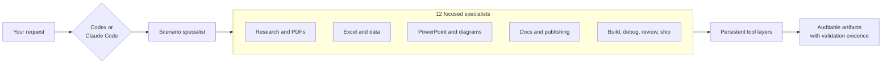
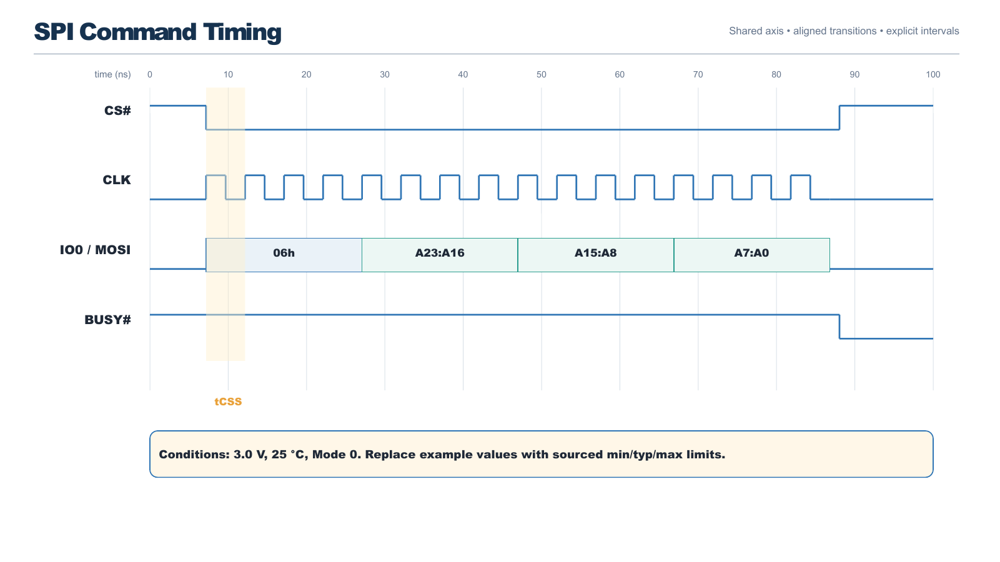
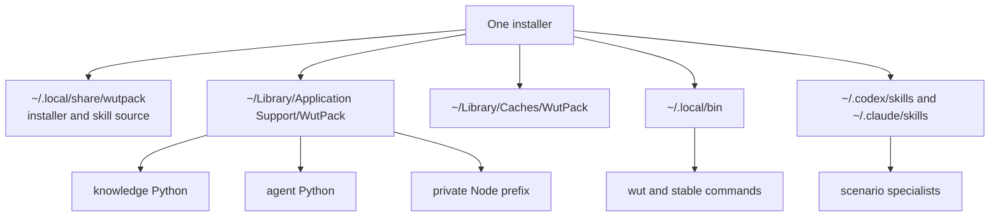

# WutPack

[](https://github.com/sfungwinbond/Gstackwut/actions/workflows/validate.yml)

**One install. Twelve specialists. A Mac workbench that is still there tomorrow.**

WutPack turns a fresh Codex or Claude Code setup into a practical knowledge-work
station. It installs durable document, data, browser, diagram, publishing, and
agent tools, then adds focused skills that know when and how to use them.

The point is not another folder of prompts. The point is a working toolchain:
inspect a datasheet, recover a broken PDF, build a Windows-safe workbook, draw an
editable PowerPoint timing diagram, analyze a dataset, publish code as HTML, or
take a code change through review—with the same commands available in the next
terminal and the next agent session.

## Install

On macOS, run:

```bash
curl -fsSL https://raw.githubusercontent.com/sfungwinbond/Gstackwut/main/install.sh | bash
```

Open a new terminal, then verify the workbench:

```bash
wut doctor
wut routes
```

The default `full` profile is the maximal setup. It installs desktop apps and
command-line tools, a managed Python 3.12 knowledge environment, a separate
agent-framework environment, private Node tooling, and skills for every detected
host. It does **not** collect credentials or configure API keys.

Prefer to inspect code before running it? Clone the repository, read
[`install.sh`](install.sh) and [`setup`](setup), then run `./setup`.

## How it works



The agent routes the job to a specialist. The specialist supplies a workflow,
quality gates, and deterministic helper scripts. The installed applications and
libraries do the real file or code work.

## Pick a specialist

| Scenario | Skill | Typical deliverable |
|---|---|---|
| Current, attributable research | `research-brief` | Decision brief with primary-source citations |
| Excel models, formulas, and charts | `spreadsheet-lab` | Editable `.xlsx`, validated and render-checked |
| Scanned, damaged, or difficult PDFs | `pdf-forensics` | Repaired/searchable PDF plus extraction report |
| Engineering diagrams in PowerPoint | `technical-deck` | Native editable shapes, connectors, and charts |
| CSV, Parquet, SQL, statistics, or ML | `data-lab` | Reproducible notebook, figures, and findings |
| HTML/PDF sites, books, and API docs | `publish-docs` | Quarto, MkDocs, Sphinx, pdoc, or TypeDoc output |
| Architecture, sequence, and state diagrams | `system-diagram` | Mermaid/Graphviz/PlantUML source plus render |
| Professional Word or OpenDocument files | `document-studio` | Structured `.docx`/`.odt` with compatibility check |
| Implementing repository changes | `code-build` | Scoped change with tests and handoff |
| Root-cause debugging | `debug-lab` | Reproduction, evidence, fix, and regression test |
| Pre-merge review | `review-gate` | Severity-ordered actionable findings |
| Release readiness | `ship-check` | READY/NOT READY verdict with evidence |

Use natural language and let the host select a skill, or invoke one explicitly:

```text
# Codex
$spreadsheet-lab Build a comparison workbook from the three PDFs in this folder.

# Claude Code
/spreadsheet-lab Build a comparison workbook from the three PDFs in this folder.
```

## What gets installed

| Layer | Selected tools |
|---|---|
| Desktop workbench | LibreOffice, Chromium, Quarto, draw.io, Inkscape |
| AI coding and agent CLIs | Codex, Claude Code, Gemini CLI, OpenCode, Agent Canvas, Hermes, Goose, Aider |
| Office, PDF, and media | openpyxl, XlsxWriter, python-docx, python-pptx, CairoSVG, Pandoc, Poppler, qpdf, MuPDF, OCRmyPDF, Tesseract, ImageMagick, FFmpeg |
| Data and research | pandas, Polars, Arrow, DuckDB, SciPy, scikit-learn, statsmodels, JupyterLab, Playwright, Selenium, Scrapy |
| Diagrams and documentation | PptxGenJS, Mermaid, Graphviz, PlantUML, Typst, MkDocs, Sphinx, pdoc, Doxygen, JSDoc, TypeDoc |
| Engineering utilities | GitHub CLI, ripgrep, fd, fzf, jq, yq, ShellCheck, shfmt, delta, hyperfine, just |

The manifests are the source of truth, and the maximal profile includes more
libraries than this summary. Fast-moving agent frameworks live in their own
Python environment so their upgrades do not destabilize Office and data work.

## What this looks like in practice

### Datasheets to an Excel decision model

```text
$pdf-forensics Inspect every flash datasheet in Downloads. Extract erase timing,
capacity, die count, and test conditions with page-level provenance.

$spreadsheet-lab Build a 512 Mb / 1 Gb / 2 Gb comparison workbook. Keep sourced
values separate from estimates, add uncertainty for multi-die variance, create a
chart tab, recalculate, and verify it opens in Windows Excel.
```

The first specialist diagnoses text layers and table geometry; the second works
with native cells and charts, checks Open XML relationships, and uses LibreOffice
as an independent compatibility pass.

### Editable technical PowerPoint—not a flattened picture

```text
$technical-deck Draw the SPI command timing as aligned waveforms. Use native
PowerPoint shapes and labels, preserve one time axis, then render-check the deck.
```

[](examples/technical-diagram-demo.pptx)

The image is a preview. The linked deck keeps the waveform segments, labels,
callouts, and comparison chart editable in PowerPoint. Its numbers are explicitly
illustrative, not product claims. Generate a fresh example with
`wut deck my-diagram.pptx`.

### A reproducible data answer

```text
$data-lab Profile survey.parquet, document missingness and exclusions, compare a
simple baseline with two models, report uncertainty, and deliver a rerunnable
notebook plus an executive chart.
```

The environment includes pandas, Polars, DuckDB, Arrow, SciPy, scikit-learn,
statsmodels, Jupyter, Plotly, Altair, and common validation libraries. The raw
input stays unchanged and assumptions travel with the result.

### Code to browsable documentation

```text
$publish-docs Turn this Python package and its notebooks into a searchable HTML
site, with API reference, one runnable tutorial, and a PDF handout.
```

Quarto, Pandoc, MkDocs, Sphinx, pdoc, Doxygen, JSDoc, and TypeDoc are available,
so the specialist can choose the smallest backend that fits the source and output.

## Persistence by design



Packages are not hidden in a temporary agent sandbox or whichever Python happens
to be first on `PATH`. WutPack owns named locations, adds a small marked shell
profile block, and can repair or update those locations idempotently.

```bash
wut paths                 # show every managed location
wut setup --skills-only   # refresh only the skills and command shim
wut update                # fetch the current source and re-run setup
```

## Installation choices

```text
./setup --host auto|codex|claude|both
        --profile core|full
        --skills-only
        --skip-casks
        --skip-ai-clis
        --with-extras
        --dry-run
```

- `full` is the default and adds ML libraries plus agent frameworks.
- `core` keeps the document, data, browser, diagram, publishing, and coding tools
  but omits the heavier ML and agent-framework layers.
- `--with-extras` adds Ollama and Docker Desktop.
- `--dry-run` prints package actions without changing the managed locations.

Package selections are plain text in [`manifests/`](manifests/), and each skill is
a readable folder in [`skills/`](skills/). Nothing relies on a mystery binary.

## Useful commands

```bash
wut doctor                         # environment health
wut skills                         # installed specialists
wut python analysis.py             # managed knowledge Python
wut lab                            # JupyterLab
wut diagram architecture.mmd architecture.svg
wut deck architecture.pptx
wut render report.docx ./rendered
wut ocr scan.pdf searchable.pdf
```

See the [getting-started tutorial](docs/getting-started.md), [workflow recipes](docs/how-to-workflows.md),
[command reference](docs/commands.md), and [persistence design](docs/why-persistent.md).

## Boundaries

- macOS is the supported bootstrap target; both Apple Silicon and Intel Homebrew
  locations are detected.
- First-time `full` setup is intentionally substantial and can take a while.
- Agent logins, model-provider keys, and paid service choices remain under your
  control.
- Agent runners are installed but are not auto-launched or silently granted
  filesystem access; configure each host's permission and sandbox model yourself.
- Advanced Office features such as macros, tracked changes, and proprietary chart
  extensions still require format-specific care; the skills call those limits out.
- Updating is explicit. Re-running setup is idempotent, but package versions follow
  their upstream package managers rather than a frozen appliance image.

WutPack is MIT licensed. See [`LICENSE`](LICENSE).
