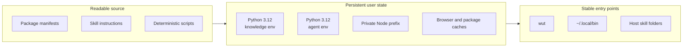

# Why persistence matters

An agent can write an excellent script and still fail the next day because the
PDF binary was installed into an ephemeral environment, `pip` modified the system
interpreter, Chromium landed in an unknown cache, or a shell restart lost `PATH`.
WutPack treats the workbench itself as maintained infrastructure.

## Ownership model



| Layer | Location | Reason |
|---|---|---|
| Installer and canonical skills | `~/.local/share/wutpack` | Updateable source independent of a project checkout |
| Python and Node environments | `~/Library/Application Support/WutPack` | Named user state, separate from system Python and global npm |
| Downloads and browser wheels | `~/Library/Caches/WutPack` | Reusable but disposable cache data |
| Stable commands | `~/.local/bin` | One conventional `PATH` entry |
| Codex skills | `~/.codex/skills` | Native host discovery |
| Claude Code skills | `~/.claude/skills` | Native host discovery |

## Why two Python environments

Document and data libraries have a different dependency surface from agent
frameworks. Keeping them apart reduces the chance that upgrading a fast-moving
agent package breaks spreadsheet, PDF, notebook, or publishing work. Both use a
managed Python 3.12 runtime, avoiding dependence on Apple's system interpreter or
an ad hoc Homebrew Python.

## Why a private Node prefix

Coding-agent CLIs, Mermaid, PowerPoint generation, and documentation tools can be
installed without `sudo` and without modifying the system-wide npm prefix. The
shell block adds that private `bin` directory and its module path in future
terminals.

## Idempotence and repair

Running setup again skips present Homebrew packages, upgrades managed package
sets, recopies canonical skills, repairs symlinks it owns, and refuses to replace
a non-symlink command at the same path. The shell profile block has explicit
markers and is added at most once per profile file.

Persistence is not the same as immutability: upstream package managers can ship
new versions. The manifests make the desired set inspectable, while `wut doctor`
provides a quick health check after an update.

## Security boundary

The installer downloads package-manager artifacts, but it does not run separate
third-party agent bootstrap scripts, read browser profiles, harvest existing
credentials, or write provider keys. Codex, Claude Code, GitHub, model providers,
and other services keep their own normal sign-in flows.

For a lower-trust evaluation, read the scripts first and run:

```bash
./setup --skills-only --host both
./setup --profile core --skip-casks --skip-ai-clis --dry-run
```

See [getting started](getting-started.md), [workflow recipes](how-to-workflows.md),
the [command reference](commands.md), or the [README](../README.md).
